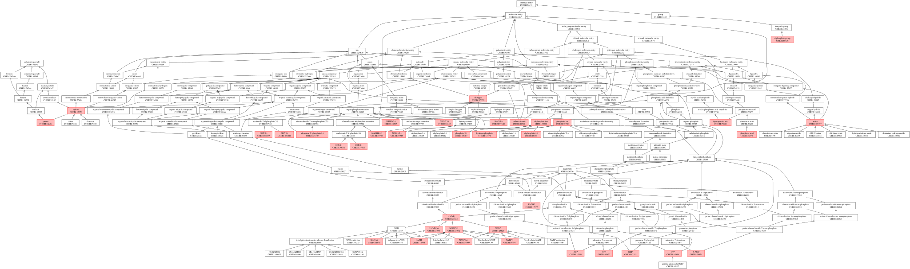

# biopaxMoleculesBlacklistSIF

Analysis of the small molecules blacklisted in [Paxtools](https://www.biopax.org/Paxtools/) using the [ChEBI](https://www.ebi.ac.uk/chebi/) ontology.

The ChEBI identifiers were retrieved from the files:
- [`blacklist.txt`](https://github.com/BioPAX/Paxtools/blob/master/pattern/src/test/resources/org/biopax/paxtools/pattern/blacklist.txt)
- [`blacklist-names.txt`](https://github.com/BioPAX/Paxtools/blob/master/pattern/src/main/resources/org/biopax/paxtools/pattern/miner/blacklist-names.txt)

-----

Small molecules from the SIF rules blacklist with the ChEBI ancestors (generated by the script [`chebi-blacklist-SIFrules.py`](chebi-blacklist-SIFrules.py) using the [kgExplorer](https://gitlab.com/odameron/kgExplorer) library).

